# Diagrams
## Table of Contents
- [Entity relationship Diagram](#entity-relationship-diagram)
- [Class Diagram](#class-diagram)
- [Flow Chart](#flow-chart)
- [Sequence Diagrams](#sequence-diagrams)
- [Gantt Charts](#gantt-charts)

## Entity Relationship Diagram
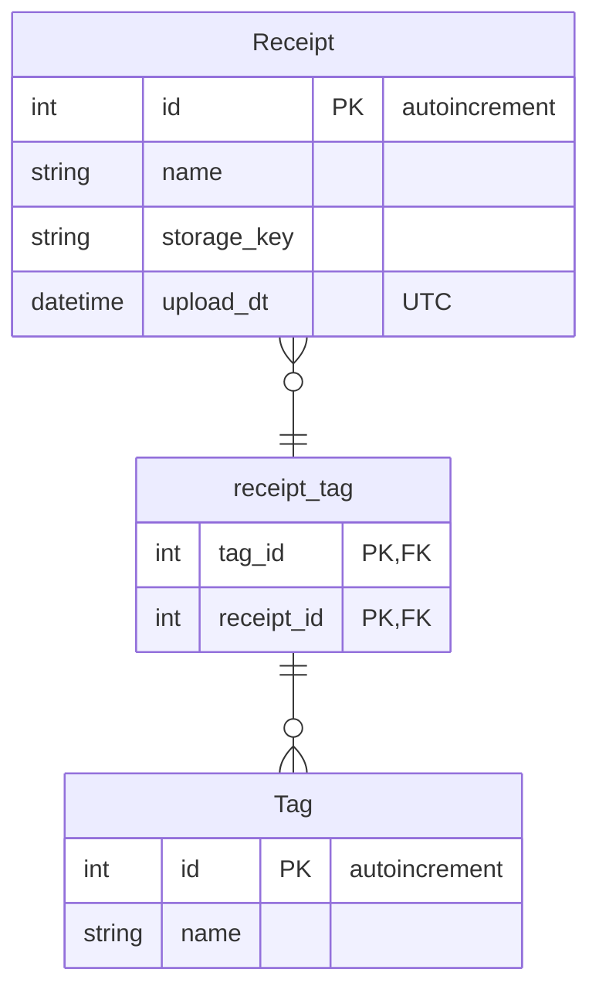

## Class Diagram
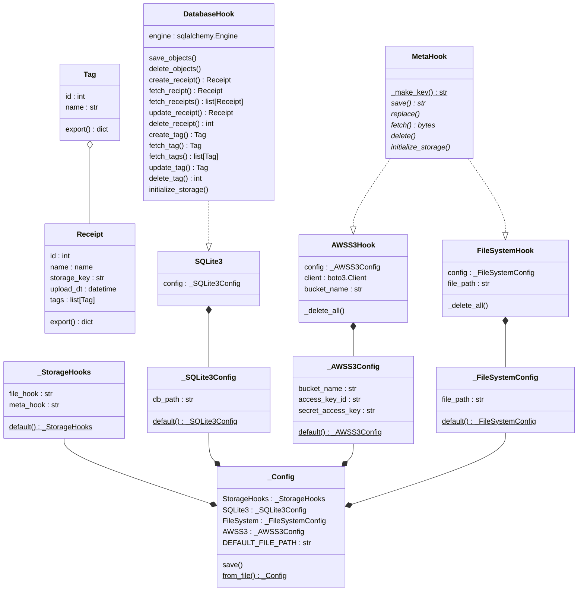

## Flow Chart
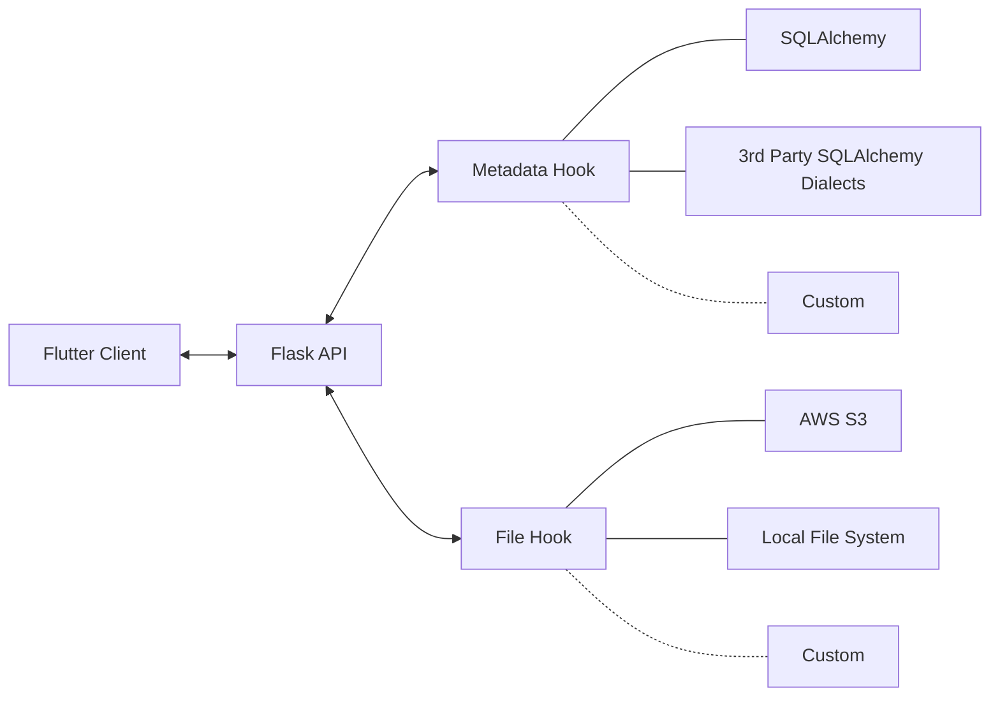

## Sequence Diagrams
### Upload Receipt
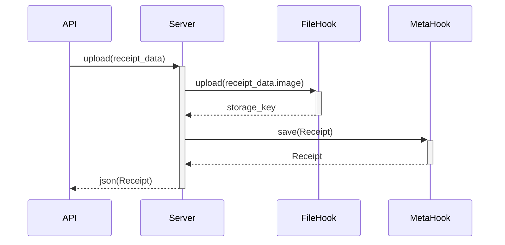
### Fetch Receipt(s)
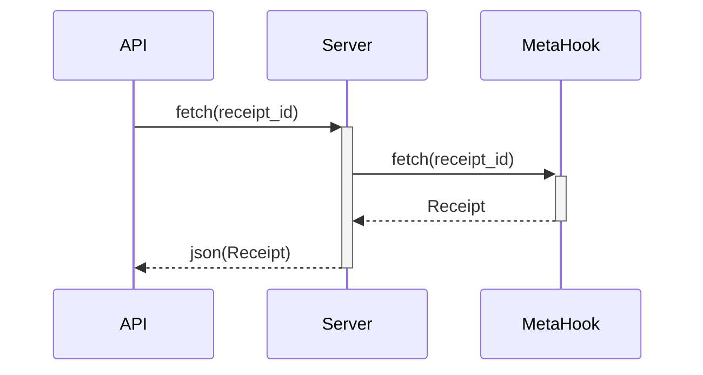

### View Receipt
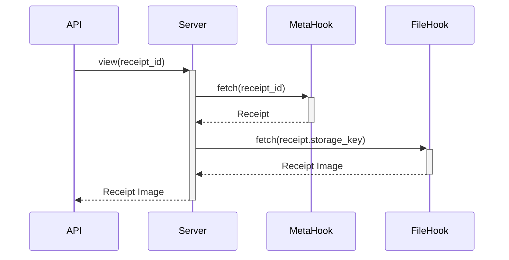

### Update Receipt
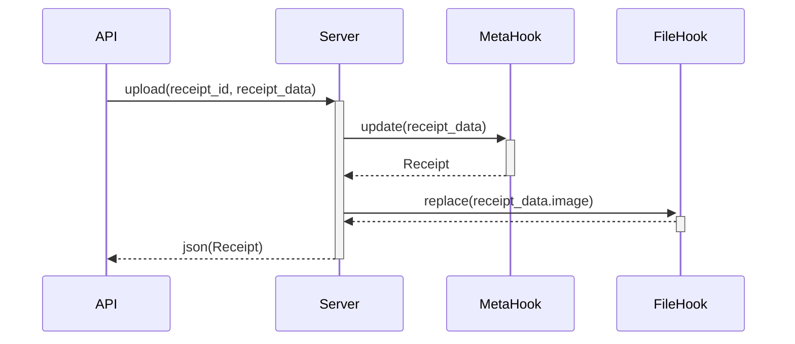

### Delete Receipt
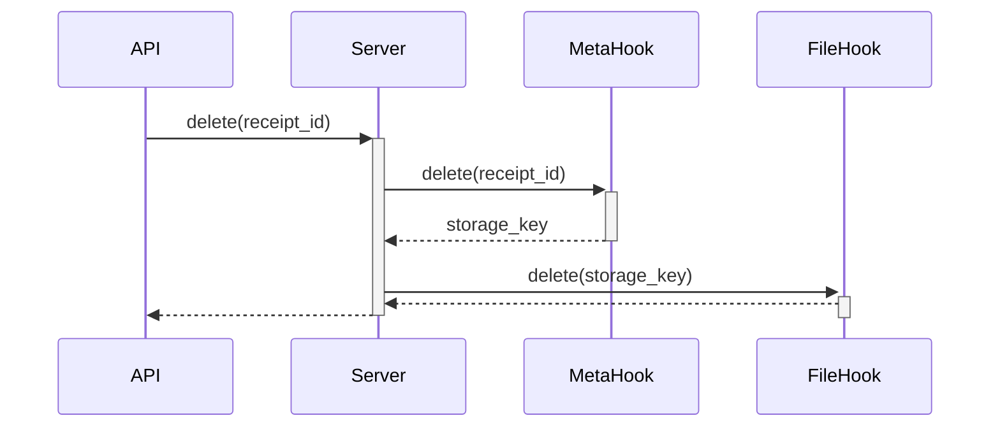

### Create Tag
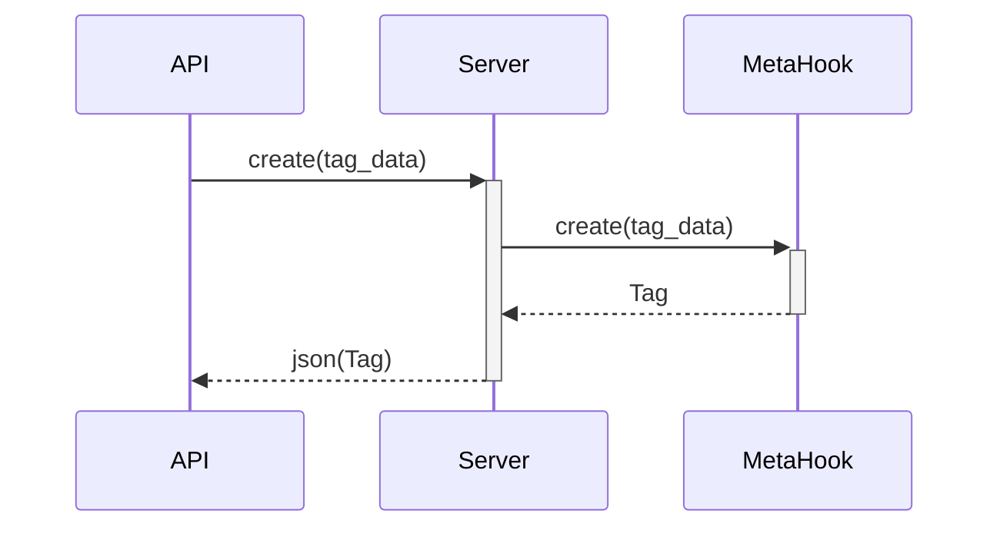

### Fetch Tag

### Update Tag
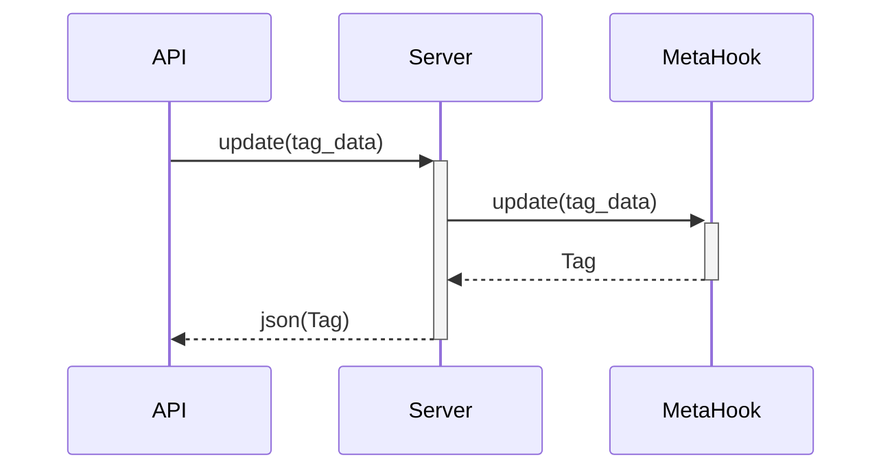

### Delete Tag
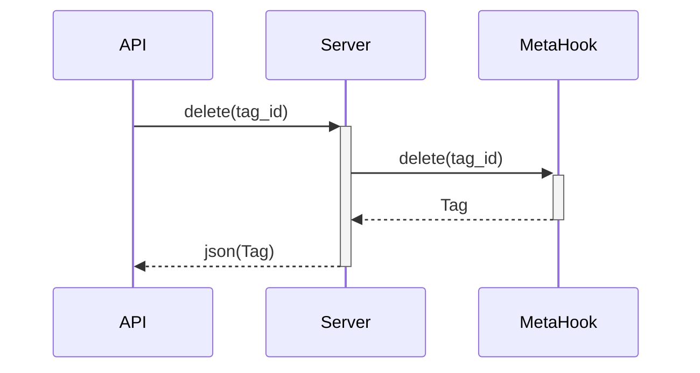

## Gantt Charts
### Original
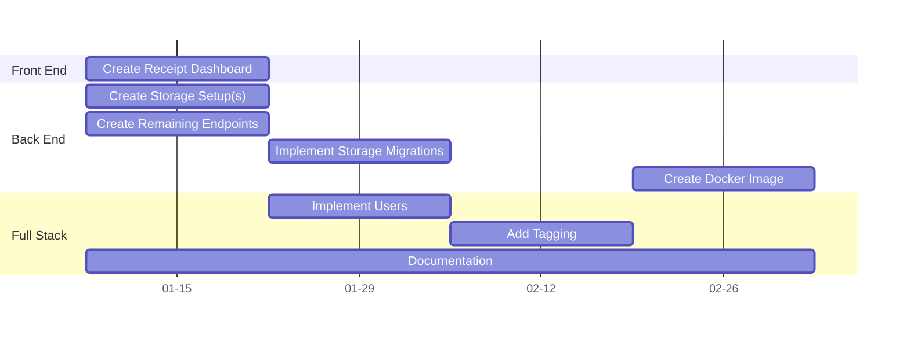

### Realized
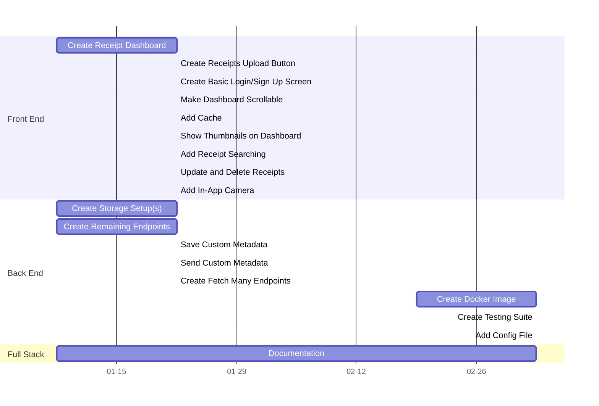

### Issues
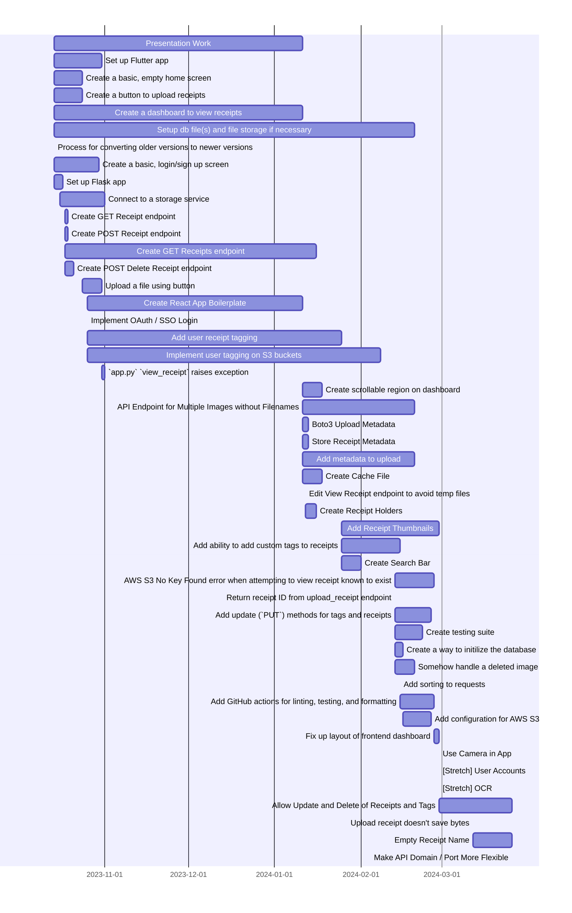