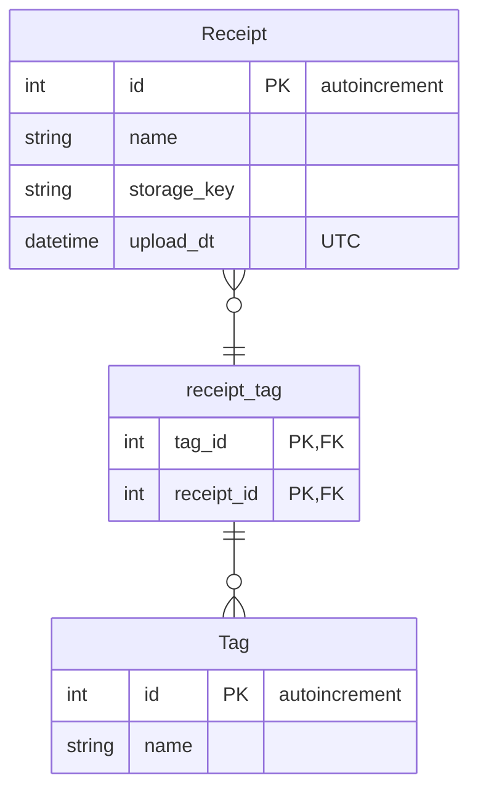
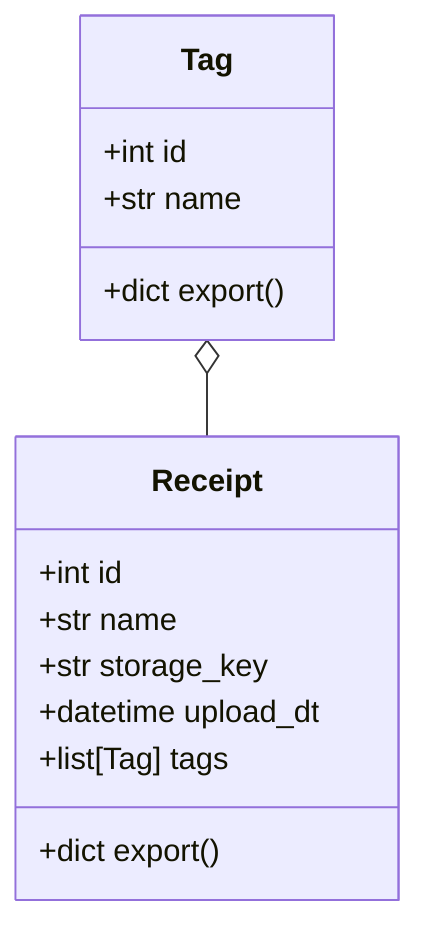

# Diagrams
## Overview
## Entity Relationship Diagram

```mermaid
erDiagram
    Tag {
        int id PK "autoincrement"
        string name
    }
    Receipt {
        int id PK "autoincrement"
        string name
        string storage_key
        datetime upload_dt "UTC"
    }
    receipt_tag {
        int tag_id PK, FK
        int receipt_id PK, FK
    }

    Receipt }o--|| receipt_tag: ""
    receipt_tag ||--o{ Tag: ""
```

## Class Diagram

```mermaid
classDiagram
    class Tag{
      +int id
      +str name
      +dict export()
    }
    class Receipt{
      +int id
      +str name
      +str storage_key
      +datetime upload_dt
      +list[Tag] tags
      +dict export()
    }

    Tag o-- Receipt
```

## Sequence