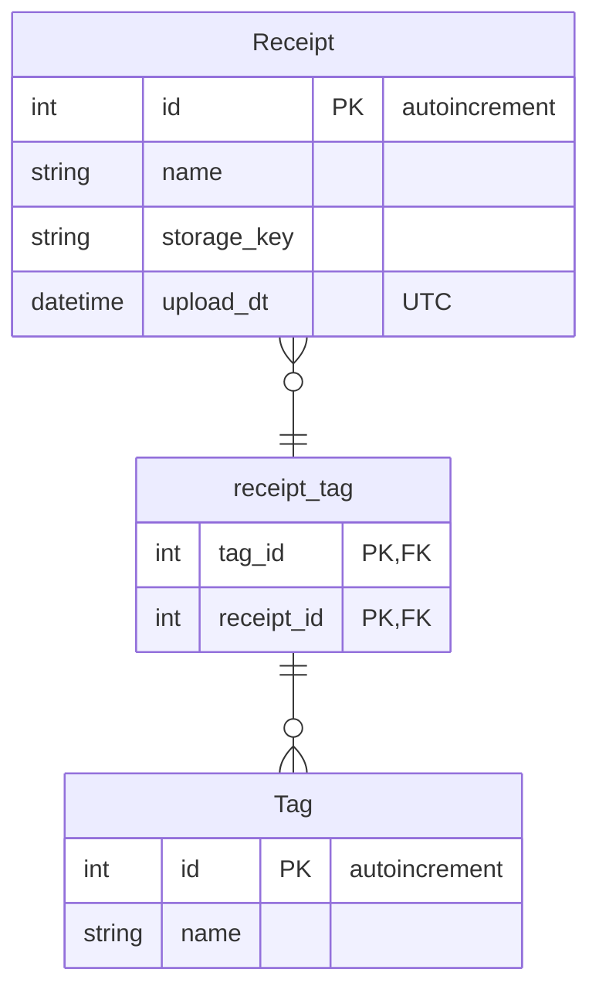
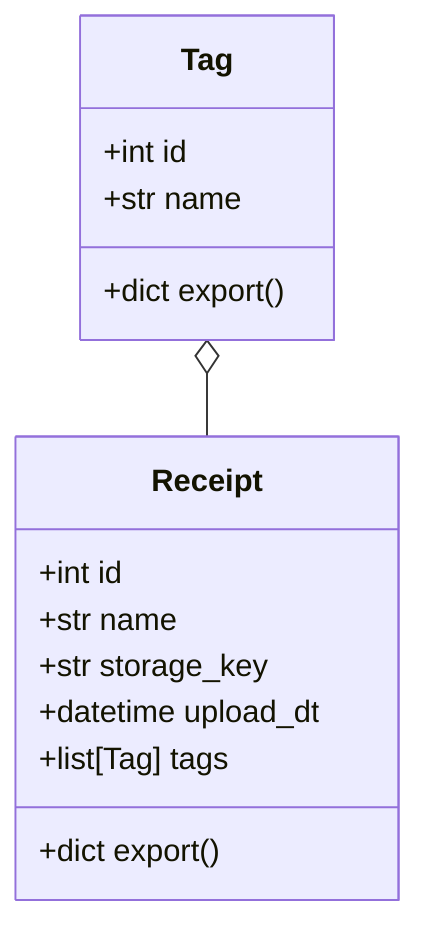
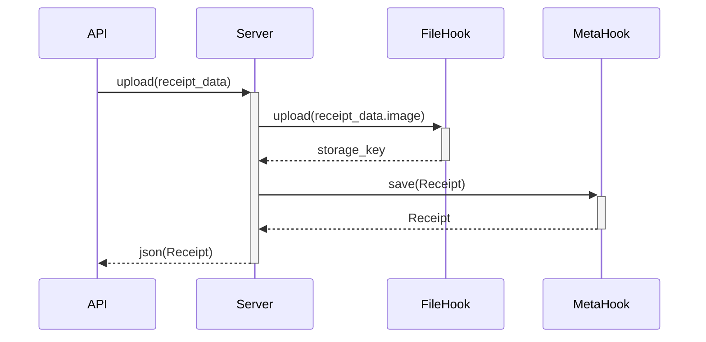
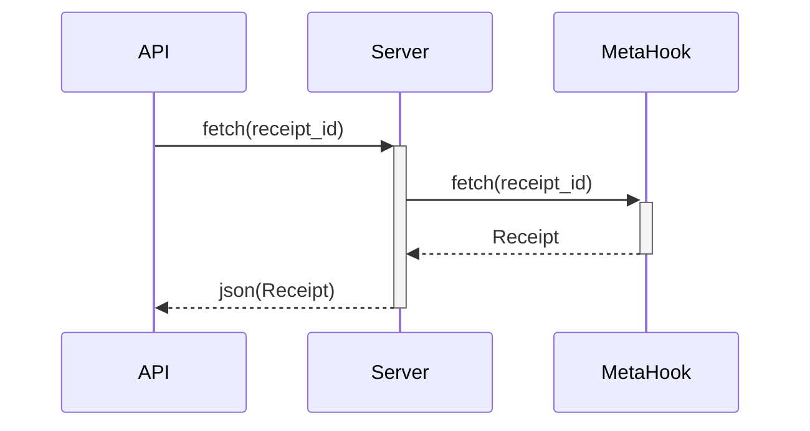
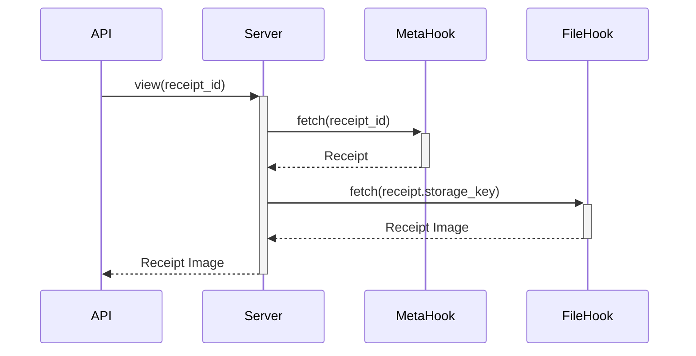
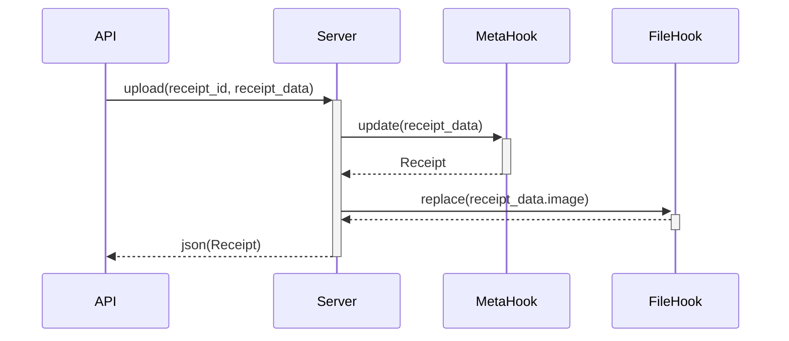
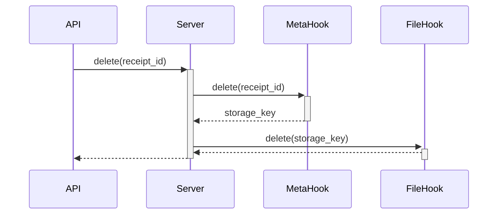
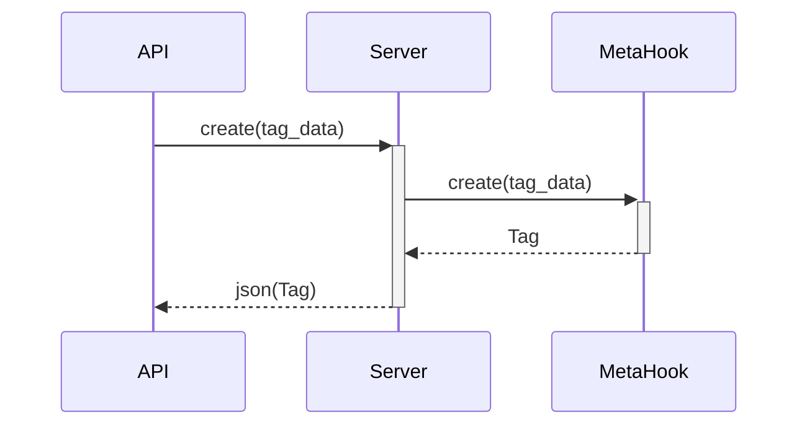
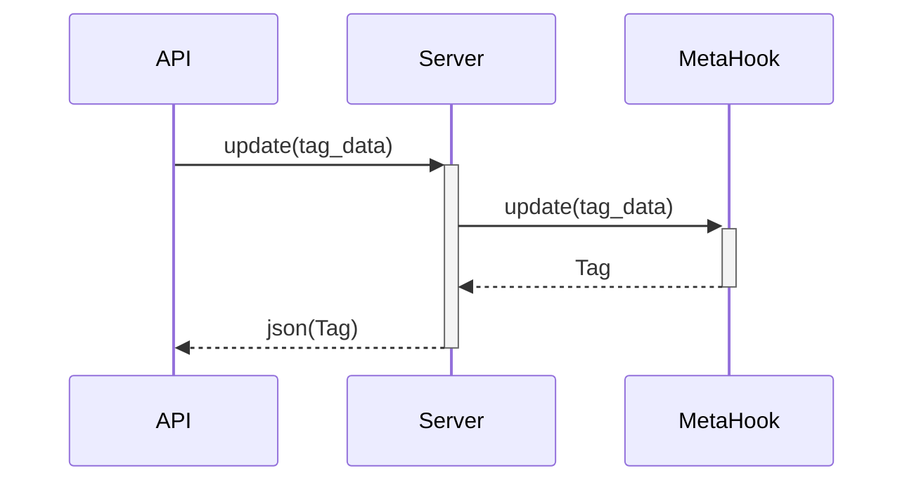
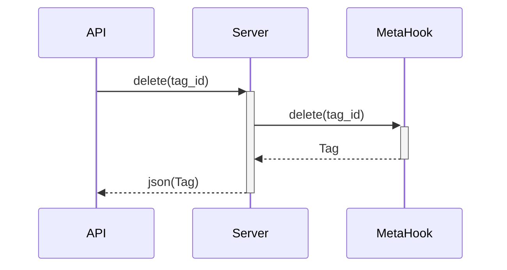

# Diagrams
## Overview
## Entity Relationship Diagram

## Class Diagram

## Sequence
### Upload Receipt

### Fetch Receipt(s)

### View Receipt

### Update Receipt

### Delete Receipt

### Create Tag

### Fetch Tag

### Update Tag

### Delete Tag

